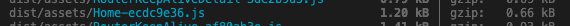

# vue3+vite 如何打包优化

## 前言
首先，在没有做任何配置之前，npm run bulid 看一下打包之后的目录结构情况：


可以看出，第三方依赖包文件在没有处理的情况下是非常大的，而且随着版本的迭代、业务的增多，第三方依赖也会越来越多，打包出来的文件也会越来越大，从而造成网页在首次进入时比较缓慢。针对这个问题，首先想到的是分包的解决方案，将一个大文件分割成多个小文件，在第一次进入网页时可以提升加载速度。

## 区块分割（chunk split）

根据 vite 官方文档提示，在vite的配置文件，通过 build.rollupOptions 的配置进行手动配置。

vite官网：https://cn.vitejs.dev/config/build-options.html#build-rollupoptions
rollupOptions 配置参考网站：
https://rollupjs.org/configuration-options/#output-manualchunks

代码如下：
```
// vite.config.ts
import { fileURLToPath, URL } from 'node:url'
import { defineConfig } from 'vite'
import vue from '@vitejs/plugin-vue'
import DefineOptions from 'unplugin-vue-define-options/vite'

// https://vitejs.dev/config/
export default defineConfig({
  plugins: [vue(), DefineOptions() ],
  resolve: {
    alias: {
      '@': fileURLToPath(new URL('./src', import.meta.url))
    }
  },
  build: {
    rollupOptions: {
      output: {
        manualChunks(id: any) {
          // 最小化拆分包
          if (id.includes('node_modules')) {
            return id.toString().split('node_modules/')[1].split('/')[0].toString()
          }
        }
      }
    }
  }
})

```

通过上述优化，再一次进行 npm run bulid 打包，看一下结果


这时候可以看出来，根据依赖分别拆分，打包出来的文件数量变多，单个文件的大小变小了。 在这个基础上可以继续扩展，例如：

### 1、根据文件分类和重命名，把css、png、js分开

```
rollupOptions: {
      output: {
        // 用于命名代码拆分时创建的共享块的输出命名
        chunkFileNames: `assets/chunk/[name]-[hash].js`,
        // 用于从入口点创建的块的打包输出格式
        entryFileNames: `assets/entry/[name]-[hash].js`,
        // 用于输出静态资源的命名，打包后的目录中可能会出现png、jpg、svg、ttf、gif等目录。
        assetFileNames: `assets/[ext]/[name]-[hash].[ext]`,
        manualChunks(id: string) {
          // 最小化拆分包
          if (id.includes('node_modules')) {
            return id.toString().split('node_modules/')[1].split('/')[0].toString()
          }
        }
      }
    }
```
通过chunkFileNames、entryFileNames、assetFileNames实现分包和重命名，效果如下


### 2、将业务模块分块打包，把第三方插件和实际业务模块分开

根据实际项目的具体情况分模块，比如我的 views 中，一个文件夹就是一个模块；我还想让css和图片就统一在 assets 中，重新规划一下文件后，代码如下：

```
 build: {
    rollupOptions: {
      output: {
        // 按照一个模块一个文件，而且与第三方区分开
        chunkFileNames: (chunkInfo) => {
          const { name, isDynamicEntry } = chunkInfo
          if (isDynamicEntry) {
            return `js/views/${name}-[hash].js`
          }
          return `js/vendor/${name}-[hash].js`
        },
        // 用于从入口点创建的块的打包输出格式
        entryFileNames: `js/[name]-[hash].js`,
        // assetFileNames 不设置 所有css和图片文件就默认在assets中
        // assetFileNames: `assets/[ext]/[name]-[hash].[ext]`,
        manualChunks(id: string) {
          // 最小化拆分包
          if (id.includes('node_modules')) {
            return id.toString().split('node_modules/')[1].split('/')[0].toString()
          }
          // 一个模块只要一个文件，如果需要一个vue一个文件，以下代码可忽略
          if (id.includes('/src/views/')) {
            return id.toString().split('/src/views/')[1].split('/')[0]
          }
        }
      }
    }
  }
```
效果如下：


也可以分不同的文件夹，打包之后每个模块一个文件夹

```
 build: {
    rollupOptions: {
      output: {
          // 用于命名代码拆分时创建的共享块的输出命名
        chunkFileNames: (chunkInfo) => {
          const facadeModuleId = chunkInfo.facadeModuleId
            ? chunkInfo.facadeModuleId.split('/')
            : [];
          const fileName =
            facadeModuleId[facadeModuleId.length - 2] || '[name]';
          return `js/${fileName}/[name].[hash].js`;
        },
        // 用于从入口点创建的块的打包输出格式
        entryFileNames: `js/[name]-[hash].js`,
        // assetFileNames 不设置 所有css和图片文件就默认在assets中
        // assetFileNames: `assets/[ext]/[name]-[hash].[ext]`,
        manualChunks(id: string) {
          if (id.includes('node_modules')) {
            return 'vendor'
          }
          // 一个模块只要一个文件，如果需要一个vue一个文件，以下代码可忽略
          if (id.includes('/src/views/')) {
            return id.toString().split('/src/views/')[1].split('/')[0]
          }
        }
      }
    }
  }
```


### 3、第三方代码分包后，文件过于琐碎，只单独提出个别大文件

例如：我要拆分出来vue、element-plus、fit2cloud-ui-plus、axios

```
 build: {
    rollupOptions: {
       output: {
        // 用于命名代码拆分时创建的共享块的输出命名
        chunkFileNames: (chunkInfo) => {
          const { name, isDynamicEntry } = chunkInfo
          if (isDynamicEntry) {
            return `js/views/${name}-[hash].js`
          }
          return `js/vendor/${name}-[hash].js`
        },
        // 用于从入口点创建的块的打包输出格式
        entryFileNames: `js/[name]-[hash].js`,
        // 用于输出静态资源的命名，打包后的目录中可能会出现png、jpg、svg、ttf、gif等目录。
        // assetFileNames: `assets/[ext]/[name]-[hash].[ext]`,
        manualChunks(id: string) {
          // 根据不同模块
          if (id.includes('/src/views/')) {
            return id.toString().split('/src/views/')[1].split('/')[0]
          }
          if (id.includes('node_modules')) {
            if (id.includes('vue')) {
              return 'vue'
            } else if (id.includes('axios')) {
              return 'axios'
            }
            return 'vendor'
          }
        }
      }
    }
  }
```
效果如下：


当然 vendor 和 vue 仍然可以进一步拆分，根据需要。

如果项目中有 echart 或者 富文本编辑器，只是想把这些单独打包，并不想复杂分类，那么也可以像以下代码这样，简洁配置
```
  rollupOptions: {
      output: {
        manualChunks: {
          editor: ['mavon-editor', '@kangc/v-md-editor']
        },
      },
    },
```
除此之外，还有一些第三方的拆分插件工具可以使用，
比如：vite-plugin-chunk-split。https://github.com/sanyuan0704/vite-plugin-chunk-split#readme


## 打包压缩

对文件进一步压缩，让文件更小，以下是打包压缩的几种方法：

### 1、build.minify

vite官网有介绍，build.minify 包括两个模式，'terser' 和 'esbuild'，build.minify开启以后，默认是为 esbuild，它比 terser 快 20-40 倍，压缩率只差 1%-2%。当设置为 'terser' 时必须先安装 Terser。

```
npm add -D terser
```

然后用 build.terserOptions 对 terser 进行配置。
但是也要注意，在 lib 模式下使用 'es' 时，build.minify 选项不会缩减空格，因为会移除掉 pure 标注，导致破坏 tree-shaking。

```
  build: {
    minify: 'terser',
    // 去掉 console、debug
    terserOptions: {
      compress: {
        drop_console: true,
        drop_debugger: true,
      },
    },
    ...
  }
```
对比一下配置 terser 之后，打包出来的文件大小


文件确实小了那么一些些，可以根据项目需要选择是否用这种模式打包。也可以区分出来开发环境和生产环境的配置，避免影响调试。

### 2、vite-plugin-compression

vite-plugin-compression 插件，可以自动在构建时进行 gzip 压缩，并支持多种压缩算法。

安装插件

```
npm install vite-plugin-compression -D
```
然后在 vite.config.ts 中进行如下配置：
```
  plugins: [
    vue(),
    viteCompression({
      // gzip静态资源压缩配置
      verbose: true,     // 是否在控制台输出压缩结果
      disable: false,    // 是否禁用压缩
      threshold: 10240,  // 启用压缩的文件大小限制
      algorithm: 'gzip', // 采用的压缩算法
      ext: '.gz', // 生成的压缩包后缀
    }),
  ],
```


此时打包文件夹中多出几个 gz 结尾的文件，文件大小会比没压缩之前小了一些些，但是此方法也会存在一些缺点：
- 压缩的静态文件需要消耗一定的 CPU 和内存资源；
- 针对个别大文件可以进行进一步压缩，不是很大的文件不建议这样处理，因为浏览器解压时间可能大于请求原来资源的时间，反而适得其反；
- 在某些情况下，压缩算法可能会导致压缩后的文件无法正常解压或运行，因此需要进行充分的测试和验证。


此外也有其他压缩插件，比如 rollup-plugin-gzip，功能是一样的，缺点也是增加 CPU 消耗；配合vite的内置压缩，更推荐 vite-plugin-compression。也有图片和 css 的压缩工具 vite-plugin-imagemin 等等。

综上所述，考虑到浏览器解压的问题，对于大文件还是进行拆分更推荐一些。

## 懒加载和异步组件

通过懒加载模块避免一次加载所以模块，然后每个模块中还可以使用异步加载，加速网站响应速度，提高用户体验。

### defineAsyncComponent

在 Vue 2.x 中，声明一个异步组件只需这样：

```
const asyncPage = () => import('./views/home.vue')

```

在 Vue 3.x 中，声明一个异步组件只需这样：

```
import { defineAsyncComponent } from 'vue'
const child = defineAsyncComponent(() => import('@/components/async-component-child.vue'))

```
此外还支持高级选项配置，参考 vue3 官方 https://cn.vuejs.org/guide/components/async.html#basic-usage
```

const AsyncComponent = defineAsyncComponent({
  // 异步加载组件
  loader: () => import('./MyComponent.vue'),
  // 加载中的占位符组件
  loadingComponent: {
    template: '<div>Loading...</div>'
  },
  // 加载失败的占位符组件
  errorComponent: {
    template: '<div>Error</div>'
  },
  // 延迟多少毫秒显示loading组件（默认200ms）
  delay: 500,
  // 超时时间（默认：Infinity）
  timeout: 3000 
})
```
当组件第一次被渲染时，会触发异步加载，然后显示 loadingComponent 组件。如果加载成功，则会显示异步组件的内容；如果加载失败，则会显示 errorComponent 组件。

### 以一个简单页面为例：


在 Home.vue 中，通过点击按钮，打开一个弹窗，弹窗封装为一个组件 AddDialog.vue

代码如下：

```
// 子页面 AddDialog.vue
<template>
  <el-dialog v-model="dialogShow" title="Tips" width="30%">
    <span>This is a message</span>

    <template #footer>
      <div style="text-align: center">
        <el-button @click="emit('update:dialogVisible', false)">取消</el-button>
        <el-button type="primary" @click="emit('update:dialogVisible', false)">确认</el-button>
      </div>
    </template>

  </el-dialog>
</template>

<script setup lang="ts">
import { ref, computed } from 'vue'
const props = defineProps({
  dialogVisible: {
    type: Boolean,
  },
});
const emit = defineEmits(['update:dialogVisible'])

const dialogShow = computed({
  get() {
    return props.dialogVisible
  },
  set(val) {
    return val
  }
})

</script>
```
```
// Home.vue
<template>
  <div>
    <el-button text @click="show = true">
      打开弹窗
    </el-button>
    <add-dialog v-model:dialogVisible="show" v-if="show" />
  </div>
</template>

<script setup lang="ts">
import { ref } from 'vue'
import AddDialog from '@/components/AddDialog.vue'
const show = ref(false)
</script>
```

没有做异步懒加载的打包情况 和 加载情况如下：

在加载 Home 页面的时候，AddDialog 已经被加载


同时可以看一下打包之后，Home页的文件大小


优化一下 Home，改成 defineAsyncComponent 异步组件

```
// Home.vue
<template>
  <div>
    <el-button @click="show = true">
      打开弹窗
    </el-button>
    <add-dialog v-model:dialogVisible="show" v-if="show" />
  </div>
</template>

<script setup lang="ts">
import { ref, defineAsyncComponent } from 'vue'
const AddDialog = defineAsyncComponent(() => import('@/components/AddDialog.vue'))
const show = ref(false)
</script>
```
结果如下：

只有点开弹窗时候才加载了组件。同时，打包结果也很明显，Home.js 被拆解了，多出了一个AddDialog.js。


由此可以证明，这种方式可以拆解出异步组件，并且可以提升首次加载页面的速度。
该方法适用于大型项目，需要拆解出很多小组件，提升页面加载速度，但是需要合理规划一下拆解方案，如果拆分不合理，反而增加打包体积，影响加载速度。

### Suspense

Suspense 可以搭配异步组件一起使用，目前还是实验性功能，它让我们可以在组件树上层等待下层的多个嵌套异步依赖项解析完成，并可以在等待时渲染一个加载状态。

```
<Suspense>
  <!-- 具有深层异步依赖的组件 -->
  <Dashboard />

  <!-- 在 #fallback 插槽中显示 “正在加载中” -->
  <template #fallback>
    Loading...
  </template>
</Suspense>
```
用法有点像骨架屏，等待异步组件都完成之后，Suspense才进入完成状态。由于目前还不稳定，api也会更新，暂时不推荐使用。可以查看官方文档：https://cn.vuejs.org/guide/built-ins/suspense.html

## 其他

### 1、删除不必要的依赖项

可以通过 rollup-plugin-visualizer 插件进行可视化分析，找出哪些依赖项占用了最多的空间。然后，您可以考虑删除不必要的依赖项或将其替换为更轻量级的库。

```
import { visualizer } from 'rollup-plugin-visualizer'
export default defineConfig({
  plugins: [
    // ...
    visualizer()
    // ...
  ],
});
```


### 2、使用 CDN
引入外部CDN库也可以，但是考虑到网络安全问题并不建议使用，该方法使用 vite-plugin-cdn-import 插件，具体使用方法参考官方文档，这里不详细介绍了。
https://github.com/MMF-FE/vite-plugin-cdn-import/blob/master/README.zh-CN.md


